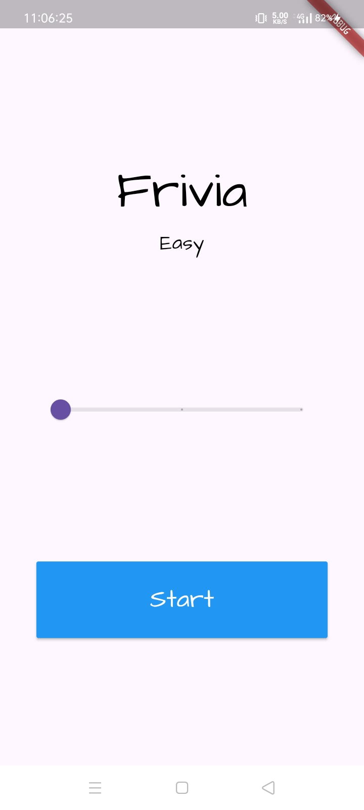
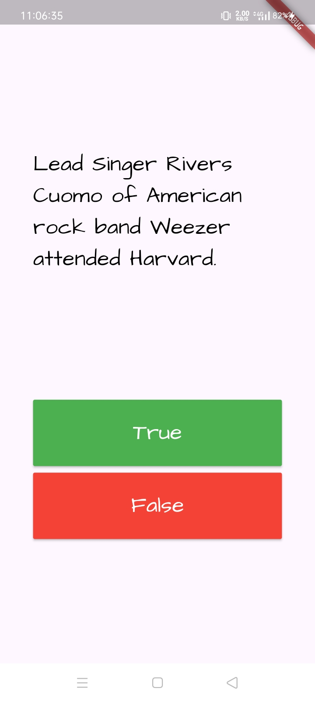
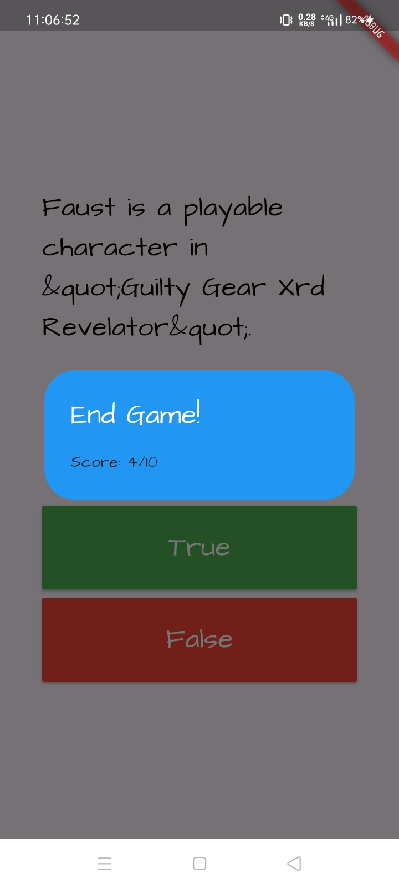

# Frivia App

Frivia is a trivia game built with Flutter that utilizes the Provider state management for tracking game states and handling UI updates. This app pulls trivia questions from the Open Trivia DB API, offers different difficulty levels, and tracks the user's score as they answer questions. 

## Table of Contents
- [Features](#features)
- [Screenshots](#screenshots)
- [Setup Instructions](#setup-instructions)
---

## Features

- **Provider State Management**: Efficient state management using the `Provider` package for real-time data updates.
- **Trivia Questions**: Trivia questions fetched from the [Open Trivia DB API](https://opentdb.com/api_config.php).
- **Customizable Difficulty**: Choose from three difficulty levels—Easy, Medium, and Hard.
- **Score Tracking**: Tracks and displays the player's score based on correct answers.
- **End Game Condition**: Alert dialog that triggers when the game ends, with options to restart.
- **Responsive UI**: Built with Flutter for smooth, responsive gameplay on mobile devices.
- **Custom Fonts**: Stylish custom fonts for an engaging visual experience.

---

## Screenshots

### 1. Home Page

**Description:** The landing screen where players select the trivia difficulty level using a slider.



### 2. Game Page - Question & Answer

**Description:** Displays a trivia question with multiple-choice answers. Players can choose an answer and proceed to the next question.



### 3. End Game Dialog

**Description:** An alert dialog that appears once the game ends, displaying the player’s score with options to restart.



---

## Setup Instructions

To run this project locally, follow these steps:

1. **Clone the repository:**
   ```bash
   git clone https://github.com/DeepDarji/Frivia.git
   cd frivia_app
   ```

2. **Install dependencies:**
   ```bash
   flutter pub get
   ```

3. **Run the app:**
   ```bash
   flutter run
   ```

---

